# Solid'Avenir - See it, Trust it, Fund it
**Crowdfunding & Impact Tracking Platform powered by Hedera Hashgraph**  

**Track:** Onchain Finance & Real-World Assets (RWA)

---

## 🔗 Official Links
- 🎓 **Certification – Hedera Hashgraph:** [View PDF](https://drive.google.com/file/d/1SNWzoYJ55lqK3ZBflzJZfvrE3rJCQAK2/view?usp=drive_link)  
- 📊 **Pitch Deck:** [View PDF](https://drive.google.com/file/d/1HSGMQ3nlVTvw3fq1CCsJu9OS5hhIC_Yu/view?usp=drive_link)  
- 📁 **Project Documentation:** [View PDF](https://drive.google.com/file/d/1TZ9Jxa-pJM1GcBHM8KzCxxV7EEgJ1ulz/view?usp=drive_link)  
- 🎥 **Demo Video (YouTube):** [Watch Video](https://www.youtube.com/watch?si=6gF8j8ZWwULKfuJY&v=nvAchPVDPoY&feature=youtu.be)  
- 🌍 **Website:** [solidavenir.com](https://solidavenir.com)  

**Solid'Avenir** provides a transparent, verifiable, and decentralized funding platform.  
Funds are released based on milestone validation, and all evidence (photos, receipts, reports) are immutably anchored on Hedera Hashgraph.

**Core pillars:**
- 🔍 Audit & verification of every project  
- 💰 Controlled, milestone-based fund release  
- 🧾 Immutable record of proofs & reports  
- 🌐 Mobile-first, offline-ready architecture  
- 🧠 DAO-based governance for future scalability  

---

## ⚙️ Hedera Integration Summary

### **Hedera Consensus Service (HCS)**
We chose HCS for immutable logging of project milestones and audit proofs because its predictable $0.0001 fee guarantees operational cost stability, essential for low-margin crowdfunding in Africa. Each validated project gets a dedicated HCS topic.

**Transactions:** `TopicCreateTransaction`, `TopicMessageSubmitTransaction`

### **Hedera Token Service (HTS)**  
We use HTS for tokenizing contributions to enable fractional ownership and transparent fund tracking. Hedera's high throughput (10,000+ TPS) ensures we can handle mass adoption across West Africa.

**Transactions:** `TransferTransaction`, `AccountBalanceQuery`

### **Hedera Account Service**
We create Hedera accounts for validated projects to enable direct, transparent fund transfers with ABFT finality in 2-3 seconds, building essential trust for African donors.

**Transactions:** `AccountCreateTransaction`

### **Transaction Types Executed**

| Transaction | Data Sent | Description |
|-------------|------------|-------------|
| `AccountCreateTransaction` | `{ initialBalance }` | Creates a new Hedera account for user/project. Returns `accountId`, `privateKey`, `publicKey`. |
| `TransferTransaction` | `{ fromAccountId, fromPrivateKey, toAccountId, amount }` | Transfers HBAR between Hedera accounts. Returns transaction status and HashScan link. |
| `AccountBalanceQuery` | — | Retrieves HBAR balance of a Hedera account. |
| `TopicCreateTransaction` | `{ memo }` | Creates an HCS Topic dedicated to a project for immutable anchoring of proofs and milestones. |
| `TopicMessageSubmitTransaction` | `{ topicId, message }` | Submits message (proof, report) to the HCS Topic. Includes HashScan and Mirror Node link for auditability. |


**Usage:**
- `AccountCreateTransaction` → Creation of Hedera accounts for validated projects
- `TransferTransaction` → Transfer of contributions (HBAR/tokens)
- `TopicCreateTransaction` → Creation of topics per validated project
- `TopicMessageSubmitTransaction` → Sending messages (proofs, reports, validations)
- `AccountBalanceQuery` → Verification of project account balances

---

## 🆔 Deployed Hedera Testnet IDs

| Component | Testnet ID | Purpose |
|-----------|------------|---------|
| Operator Account | `0.0.6808286` | Main platform account |
| HCS Topic | `0.0.7053681` | Test Project |
| *Additional IDs will be generated during judge testing* | | |

---

## 💰 Economic Justification for Hedera

Hedera's low, predictable fees ($0.0001/transaction) enable Solid'Avenir to charge only 2-5% platform fees instead of 8-15% with traditional solutions, making crowdfunding financially viable for African communities while maintaining full transparency.

1. **Low, Predictable Fees → Financial Sustainability**  
Thanks to Hedera, Solid'Avenir minimizes operational costs and offers reduced fees, maximizing funds allocated to projects.

2. **High Throughput → Mass Adoption**  
Supports thousands of simultaneous projects in West Africa, >10,000 TPS at constant cost, without prohibitive fees.

3. **ABFT Finality → Essential Trust**  
Each donation is secured with complete and instant traceability, strengthening contributor confidence.

4. **Economic Benefits for African Context**  
- **For project creators:** reduction in audit costs, faster fund access, mobile optimization  
- **For backers:** viable micro-donations, real-time impact tracking, competitive local fees  

> Hedera makes African crowdfunding safer, faster, and more accessible.

---

## 🏗️ Architecture Diagram (ASCII)

```mermaid
flowchart LR
    subgraph Frontend
        FE[🌐 Frontend<br/>UI/UX]
    end

    subgraph Backend
        BE[⚙️ Backend<br/>Django API]
    end

    subgraph Hedera
        HE[🔗 Hedera Network<br/>HCS + HTS + Mirror Nodes]
    end

    %% --- Flow connections ---
    FE -- "1️⃣ Submit Project" --> BE
    BE -- "2️⃣ Create HCS Topic" --> HE
    BE -- "3️⃣ Project Approved" --> FE
    FE -- "4️⃣ Make Payment" --> BE
    BE -- "5️⃣ HTS Token Transfer" --> HE
    FE -- "6️⃣ Submit Milestone Proof" --> BE
    BE -- "7️⃣ Submit HCS Message" --> HE
    HE -- "8️⃣ Query Mirror Node" --> BE
    BE -- "9️⃣ View Audit Reports" --> FE

    %% --- Styling ---
    style FE fill:#e1f5fe,stroke:#0288d1,stroke-width:2px
    style BE fill:#f3e5f5,stroke:#7b1fa2,stroke-width:2px
    style HE fill:#e8f5e9,stroke:#2e7d32,stroke-width:2px
```



---

### 🚀 Future Development

* 🤖 **Smart Contracts** – automatic milestone fund release
* 🪙 **Token-based DAO governance** – voting & compliance
* 📱 **Mobile App** – accessible project tracking
* 🧾 **Decentralized audit dashboard** – via Mirror Node integration
* 🔐 **Judge & AI Access** – for transparent evaluation

---

### ✅ Collaborator & Credentials

* **Collaborator Invited:** `Hackathon@hashgraph-association.com`
* **Test Credentials:** Provided in DoraHacks submission notes

---

### 🔒 Security & Credentials

**Important Security Notes**

* ✅ No private keys committed to repository
* ✅ Example configuration files provided (`.env.example`)
* 🔐 Testnet credentials provided separately to judges

---

### 🗂️ Key Audit Files

| File                         | Description                        |
| ---------------------------- | ---------------------------------- |
| `hedera_service/src/app.js`  | Core Hedera interactions           |
| `solidavenir/core/models.py` | Business logic & wallet management |
| `solidavenir/core/views.py`  | API endpoints & workflow handling  |

---

### 🌱 Environment Variables (.example)

#### **hedera_service/.env.example**

```env
HEDERA_OPERATOR_ID=
HEDERA_OPERATOR_PRIVATE_KEY=
PORT=3001
NODE_ENV=development
```

#### **solidavenir/.env.example**

```env
# Database (Postgres via Docker)
DATABASE_URL=postgres://solidavenir:solidavenir@db:5432/solidavenir_db
POSTGRES_USER=solidavenir
POSTGRES_PASSWORD=solidavenir
POSTGRES_DB=solidavenir_db
POSTGRES_HOST=db
POSTGRES_PORT=5432
```


## Project Structure

```
/hedera_service       # Node.js service for Hedera
/solidavenir          # Django backend
/scripts
  /linux              # Linux scripts (.sh)
  /windows            # Windows scripts (.bat)
docker-compose.yml    # To run services via Docker
```

---
⚠️ Important:
The platform is composed of two separate services:
1. **Django backend** (Python, runs on port 8000).
2. **Hedera service** (Node.js, runs on port 3001).

If you are not using Docker, you must open **two separate terminals**:
- Terminal 1 → run the Hedera service.
- Terminal 2 → run the Django backend.

Both must be running simultaneously for the platform to function correctly.

---

## 1. Windows Setup

1. Clone the repository:

```powershell
git clone https://github.com/dmaiga/solidavenir.git
cd solidavenir
```


2. Run the scripts in separate terminals:

```
powershell

# Terminal 1
.\scripts\windows\run_hedera_service.bat

# Terminal 2
.\scripts\windows\run_backend.bat

```

> The backend script will create a Python virtual environment, install dependencies, apply migrations, and create a **superuser admin** with:
>
> * **username:** `admin`
> * **email:** `admin@solidavenir.com`
> * **password:** `changeMe123!`
> * **user\_type:** `admin`

---

## 2. Linux Setup

1. Clone the repository:

```bash
git clone https://github.com/dmaiga/solidavenir.git
cd solidavenir
```

2. Make scripts executable:

```bash
chmod +x scripts/linux/run_hedera_service.sh
chmod +x scripts/linux/run_backend.sh
```

> ⚠️ If the scripts were edited on Windows, run:
>
> ```bash
> dos2unix scripts/linux/*.sh
> ```


3. Launch the services in separate terminals:
```bash

# Terminal 1
./scripts/linux/run_hedera_service.sh

# Terminal 2
./scripts/linux/run_backend.sh

```


> The backend script automatically:
>
> * Creates a Python virtual environment.
> * Installs all required dependencies.
> * Applies Django migrations.
> * Creates a **superuser admin** (`username=admin`, `email=admin@solidavenir.com`, `password=changeMe123!`, `user_type=admin`).

> Make sure Python 3 and `python3-venv` are installed.

---

## 3. Docker Compose Setup

1. Launch services using Docker Compose:

```bash
docker-compose up --build
```

> Tips & Precautions:
>
> * If build fails, build images separately:
>
> ```bash
> docker build -t solidavenir ./solidavenir
> docker build -t hedera_service ./hedera_service
> ```
>
> * In `core/models.py`, replace `localhost` in `ensure_wallet` with the **Docker service name** (`hedera_service`) because `localhost` inside a container refers to the container itself.
>
> * Similarly, in `views` and `forms` or any HTTP calls between services, replace `localhost` with the container name (`solidavenir_hedera`) to enable proper inter-container communication.

**Docker Compose Extract:**

```yaml
services:
  db:
    image: postgres:15
    container_name: solidavenir_db
    environment:
      POSTGRES_USER: ${POSTGRES_USER:-solidavenir}
      POSTGRES_PASSWORD: ${POSTGRES_PASSWORD:-solidavenir}
      POSTGRES_DB: ${POSTGRES_DB:-solidavenir_db}
    volumes:
      - postgres_data:/var/lib/postgresql/data
    networks:
      - solidavenir_net

  django:
    build: ./solidavenir
    container_name: solidavenir_django
    env_file:
      - ./solidavenir/.env
    depends_on:
      - db
    ports:
      - "8000:8000"
    networks:
      - solidavenir_net
    entrypoint: ["/entrypoint.sh"]

  hedera_service:
    build: ./hedera_service
    container_name: solidavenir_hedera
    env_file:
      - ./hedera_service/.env
    ports:
      - "3001:3001"
    networks:
      - solidavenir_net

volumes:
  postgres_data:

networks:
  solidavenir_net:
    driver: bridge
```

---

## 4. General Precautions

1. **Windows**: run `.bat` scripts from PowerShell using `.\script_name.bat`. Ensure Node.js and Python are in the PATH.
2. **Linux**: make `.sh` scripts executable (`chmod +x`). Use `dos2unix` for files edited on Windows. Install `python3-venv` to create virtual environments.
3. **Docker**: replace all `localhost` references with the Docker service name for inter-container communication. Build images separately if needed.

---

